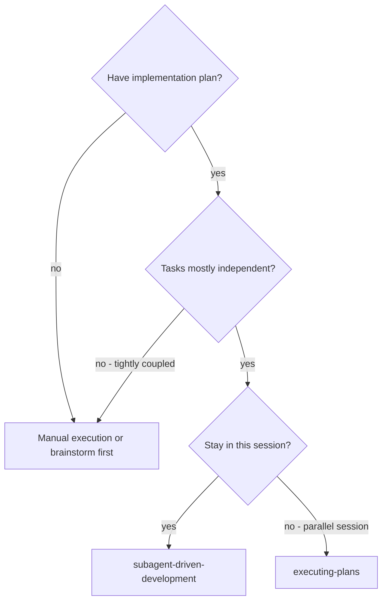

# Subagent-Driven Development

Execute plan by dispatching a fresh subagent per task, with two-stage review
after each: spec compliance first, then code quality.

**Core principle:** Fresh subagent per task + two-stage review (spec then
quality) = high quality, fast iteration.

---

## When to use this skill



**vs. `executing-plans`:**

- Same session (no context switch)
- Fresh subagent per task (no context pollution)
- Two-stage review after each task
- Faster iteration (no human-in-loop between tasks)

---

## How to use it

### Setup (once)

1. Read plan file
2. Extract **all** tasks with full text and context
3. Create task list with all items

### Per Task Loop

```
1. Dispatch implementer subagent (implementer-prompt.md)
   → If questions: Answer them → Re-dispatch
   → Subagent implements, tests, commits, self-reviews

2. Dispatch spec reviewer subagent (spec-reviewer-prompt.md)
   → If issues: Implementer fixes → Re-review
   → Until ✅ spec compliant

3. Dispatch code quality reviewer (code-quality-reviewer-prompt.md)
   → If issues: Implementer fixes → Re-review
   → Until ✅ approved

4. Mark task complete → Next task
```

### After All Tasks

1. Dispatch final code reviewer for entire implementation
2. Use `finishing-a-development-branch` skill

---

## Prompt Templates

| Template                          | Purpose                           |
| --------------------------------- | --------------------------------- |
| `implementer-prompt.md`           | Dispatch implementer subagent     |
| `spec-reviewer-prompt.md`         | Dispatch spec compliance reviewer |
| `code-quality-reviewer-prompt.md` | Dispatch code quality reviewer    |

---

## Example Workflow

```
[Read plan once, extract all 5 tasks, create task list]

── Task 1: Hook installation script ──

[Dispatch implementer with full task text + context]

Implementer: "Should hook install at user or system level?"
You: "User level (~/.config/superpowers/hooks/)"

Implementer: Implemented, 5/5 tests passing, committed.

[Dispatch spec reviewer]
Spec reviewer: ✅ Spec compliant

[Dispatch code quality reviewer]
Code reviewer: ✅ Approved

[Mark Task 1 complete]

── Task 2: Recovery modes ──

[Dispatch implementer]
Implementer: 8/8 tests passing, committed.

[Dispatch spec reviewer]
Spec reviewer: ❌ Missing progress reporting (spec: "every 100 items"), extra --json flag

[Implementer fixes]
Spec reviewer: ✅ Spec compliant

[Dispatch code quality reviewer]
Code reviewer: ❌ Magic number (100) for interval

[Implementer fixes → extracts PROGRESS_INTERVAL constant]
Code reviewer: ✅ Approved

[Mark Task 2 complete] → ...

[After all tasks: final review → finishing-a-development-branch]
```

---

## Advantages

| Advantage                     | Detail                                       |
| ----------------------------- | -------------------------------------------- |
| Fresh context per task        | No confusion from prior task context         |
| Two review gates              | Spec compliance before quality — right order |
| Questions surfaced early      | Before work begins, not after                |
| Self-review + external review | Both required                                |
| Controller curates context    | Subagent gets exactly what it needs          |

---

## Red Flags

**Never:**

- Start on `main`/`master` without explicit user consent
- Skip spec compliance review
- Start code quality review before spec is ✅
- Move to next task with open review issues
- Dispatch multiple implementers in parallel (conflicts)
- Make subagent read the plan file (provide full text instead)
- Skip the re-review after fixes (reviewer approved = actually re-reviewed)
- Accept "close enough" on spec compliance

**If subagent asks questions:** Answer fully before letting them proceed.

**If reviewer finds issues:** Implementer fixes → reviewer re-reviews → repeat
until approved.

**If subagent fails:** Dispatch a fix subagent with specific instructions. Don't
fix manually.

---

## Integration

| Skill                            | Role                                          |
| -------------------------------- | --------------------------------------------- |
| `using-git-worktrees`            | **REQUIRED:** Set up isolated workspace first |
| `writing-plans`                  | Creates the plan this skill executes          |
| `requesting-code-review`         | Template for reviewer subagents               |
| `finishing-a-development-branch` | Complete development after all tasks          |
| `test-driven-development`        | Subagents follow TDD per task                 |
| `executing-plans`                | Alternative for parallel-session execution    |
