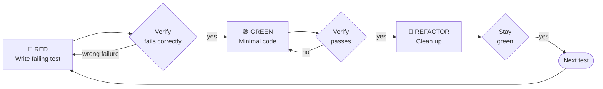

# Test-Driven Development (TDD)

## When to use this skill

Write the test first. Watch it fail. Write minimal code to pass.

**Core principle:** If you didn't watch the test fail, you don't know if it
tests the right thing.

**Violating the letter of the rules is violating the spirit of the rules.**

---

## The Iron Law

```
NO PRODUCTION CODE WITHOUT A FAILING TEST FIRST
```

Wrote code before the test? **Delete it. Start over.**

- Don't keep it as "reference"
- Don't "adapt" it while writing tests
- Don't look at it
- Delete means delete

---

## How to use it



### 🔴 RED — Write Failing Test

Write one minimal test showing what should happen.

**Good:**

```typescript
test("retries failed operations 3 times", async () => {
    let attempts = 0;
    const operation = () => {
        attempts++;
        if (attempts < 3) throw new Error("fail");
        return "success";
    };
    const result = await retryOperation(operation);
    expect(result).toBe("success");
    expect(attempts).toBe(3);
});
```

Clear name, tests real behavior, one thing.

**Bad:**

```typescript
test("retry works", async () => {
    const mock = jest.fn()
        .mockRejectedValueOnce(new Error())
        .mockResolvedValueOnce("success");
    await retryOperation(mock);
    expect(mock).toHaveBeenCalledTimes(3); // Tests mock, not code
});
```

### Verify RED — Watch It Fail (MANDATORY, never skip)

```bash
npm test path/to/test.test.ts
```

- Test fails (not errors)
- Failure message is expected
- Fails because feature is missing (not a typo)

Test passes immediately? You're testing existing behavior — fix the test.

### 🟢 GREEN — Minimal Code

Write the simplest code that makes the test pass. No extra features, no
refactoring, no "improvements."

### Verify GREEN — Watch It Pass (MANDATORY)

```bash
npm test path/to/test.test.ts
```

All tests pass? No warnings? Output pristine? → Move to REFACTOR.

### 🔵 REFACTOR — Clean Up

Remove duplication, improve names, extract helpers. Keep tests green. Don't add
behavior.

---

## Why Order Matters

| Rationalization                        | Reality                                                                      |
| -------------------------------------- | ---------------------------------------------------------------------------- |
| "I'll write tests after to verify"     | Tests after pass immediately — proves nothing. Never saw them catch the bug. |
| "Already manually tested edge cases"   | Ad-hoc ≠ systematic. No record, can't re-run, easy to forget under pressure. |
| "Deleting X hours is wasteful"         | Sunk cost fallacy. Unverified code is technical debt.                        |
| "TDD is dogmatic, I'm being pragmatic" | TDD IS pragmatic. Finds bugs before commit. Enables refactoring.             |
| "Tests after achieve the same goals"   | Tests-after: "what does this do?" Tests-first: "what should this do?"        |

---

## Red Flags — Delete Code and Start Over

- Code before test
- Test passes immediately without any implementation
- Can't explain why test failed
- "I already manually tested it"
- "Tests after achieve the same purpose"
- "Keep as reference" or "adapt existing code"
- "Already spent X hours, deleting is wasteful"
- "This is different because..."

**All of these → Delete code. Start over with TDD.**

---

## Common Cases

### Bug Fix

```
RED:    test('rejects empty email') → fails (expected 'Email required', got undefined)
GREEN:  if (!data.email?.trim()) return { error: 'Email required' }
PASS:   test passes
```

### When Stuck

| Problem                | Solution                                         |
| ---------------------- | ------------------------------------------------ |
| Don't know how to test | Write wished-for API. Write assertion first.     |
| Test too complicated   | Design too complicated. Simplify interface.      |
| Must mock everything   | Code too coupled. Use dependency injection.      |
| Test setup is huge     | Extract helpers. Still complex? Simplify design. |

---

## Verification Checklist

Before marking work complete:

- [ ] Every new function/method has a test
- [ ] Watched each test fail before implementing
- [ ] Each test failed for the expected reason (feature missing, not typo)
- [ ] Wrote minimal code to pass each test
- [ ] All tests pass with pristine output
- [ ] Tests use real code (mocks only if unavoidable)
- [ ] Edge cases and errors covered

Can't check all boxes? You skipped TDD. Start over.

---

## Final Rule

```
Production code exists → test existed and failed first
Otherwise → not TDD
```

No exceptions without your human partner's permission.
