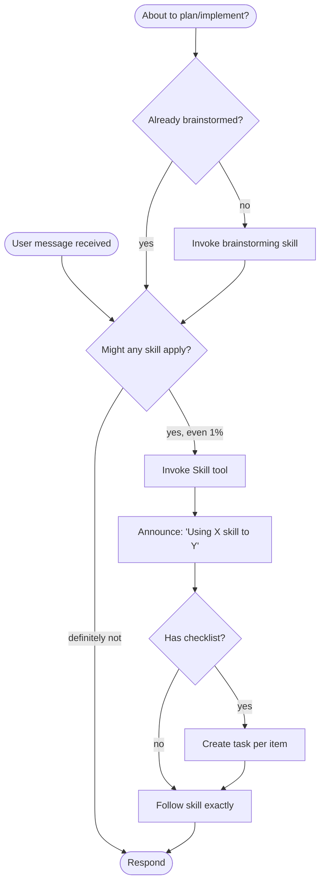

# Using Skills

> [!IMPORTANT]
> If you think there is even a **1% chance** a skill might apply to what you are
> doing, you ABSOLUTELY MUST invoke the skill.
>
> IF A SKILL APPLIES TO YOUR TASK, YOU DO NOT HAVE A CHOICE. YOU MUST USE IT.
>
> This is not negotiable. This is not optional. You cannot rationalize your way
> out of this.

---

## How to Access Skills

**In Claude Code:** Use the `Skill` tool. When you invoke a skill, its content
is loaded — follow it directly. Never use the Read tool on skill files.

**In other environments:** Check your platform's documentation for how skills
are loaded.

---

## The Rule

**Invoke relevant or requested skills BEFORE any response or action.** Even a 1%
chance means you invoke it. If it turns out to be wrong for the situation, you
don't need to use it.

---

## Red Flags — You're Rationalizing

| Thought                             | Reality                                          |
| ----------------------------------- | ------------------------------------------------ |
| "This is just a simple question"    | Questions are tasks. Check for skills.           |
| "I need more context first"         | Skill check comes BEFORE clarifying questions.   |
| "Let me explore the codebase first" | Skills tell you HOW to explore. Check first.     |
| "I can check git/files quickly"     | Files lack conversation context. Skills have it. |
| "This doesn't need a formal skill"  | If a skill exists, use it.                       |
| "I remember this skill"             | Skills evolve. Read current version.             |
| "This doesn't count as a task"      | Action = task. Check for skills.                 |
| "The skill is overkill"             | Simple things become complex. Use it.            |
| "I'll just do this one thing first" | Check BEFORE doing anything.                     |

---

## Skill Priority

When multiple skills could apply:

1. **Process skills first** (`brainstorming`, `systematic-debugging`) —
   determine HOW to approach
2. **Implementation skills second** (domain-specific) — guide execution

- "Let's build X" → `brainstorming` first, then implementation skills
- "Fix this bug" → `systematic-debugging` first, then domain-specific skills

---

## Skill Types

| Type         | Examples                                          | Approach                                     |
| ------------ | ------------------------------------------------- | -------------------------------------------- |
| **Rigid**    | `test-driven-development`, `systematic-debugging` | Follow exactly. Don't adapt away discipline. |
| **Flexible** | Patterns, templates                               | Adapt principles to context.                 |

The skill itself tells you which type it is.

---

## User Instructions

Instructions say **WHAT**, not **HOW**. "Add X" or "Fix Y" doesn't mean skip
workflows. Skills define the how.
