# Khawi App Navigation Architecture

## Entry flow (canonical order)

The app entry flow is fixed and enforced by the router redirect:

1. **Splash** (`/splash`) - Branding/loading while onboarding or profile state is resolved.
2. **Onboarding** (`/onboarding`) - First-time users; cannot skip to auth until onboarding is done.
3. **Auth** (`/auth/login`) - Login (e.g. phone OTP); after onboarding, unauthenticated users go here.
4. **Profile Enrichment** (`/auth/enrichment`) - After login, if profile is missing or fullName is empty, user must complete basic profile first (name required, optional preferences).
5. **Role Selection** (`/auth/role`) - After profile is complete, if no active role is set, user chooses Passenger / Driver / Junior.
6. **Driver Verification** (`/verification`) - Drivers must verify identity (Nafath) and vehicle ownership before accessing driver routes.

Then: role-specific home (e.g. `/app/p/home`, `/app/d/dashboard`, `/app/j/hub`).  
Splash may appear again briefly after login while profile is loading, then the router sends to enrichment, role selection, or role home.

## Mermaid Flowchart (Full Routes)

```mermaid
---
config:
  layout: elk
---
flowchart TB

%% =========================
%% Shared Entry
%% =========================
subgraph Shared_Entry["Entry & Authentication"]
    SPLASH["/splash<br/>SplashScreen"]
    ONBOARDING["/onboarding<br/>OnboardingScreen"]
    LOGIN["/auth/login<br/>LoginScreen"]
    EMAIL["/auth/email<br/>EmailLoginScreen"]
    VERIF["/auth/verify<br/>SplashScreen (fallback)"]
    NAFATH["/verification<br/>NafathVerificationScreen"]
    ROLE_SEL["/auth/role<br/>RoleSelectionScreen"]
    ENRICH["/auth/enrichment<br/>ProfileEnrichmentScreen"]
    CALLBACK["/auth/callback<br/>(redirect → /splash)"]
end

%% =========================
%% Shared Features (GLOBAL)
%% =========================
subgraph Shared_Features["Shared Features"]
    NOTIF["/shared/notifications<br/>NotificationsScreen"]
    SUB_PAY["/subscription<br/>SubscriptionScreen"]
    REDEEM["/shared/redeem<br/>RedeemXpScreen"]
    REFERRAL["/referral<br/>ReferralScreen"]
    LEADERBOARD["/shared/leaderboard<br/>LeaderboardScreen"]
    PROMO["/shared/promo-codes<br/>PromoCodesScreen"]
    CARBON["/shared/carbon<br/>CarbonTrackerScreen"]
    FARE_EST["/shared/fare-estimator<br/>FareEstimatorScreen"]
    SMART_COMMUTE["/shared/smart-commute<br/>SmartCommuteScreen"]
    COMMUNITY["/shared/communities<br/>CommunitiesScreen"]
    COMM_CREATE["/shared/communities/create<br/>CreateCommunityScreen"]
    COMM_DETAIL["/shared/communities/:id<br/>CommunityDetailScreen"]
    EVENTS["/shared/events<br/>EventsScreen"]
    EVENT_DETAIL["/shared/events/:id<br/>EventDetailScreen"]
end

%% =========================
%% Passenger Flow (Shell)
%% =========================
subgraph Passenger_Flow["Passenger Shell (/app/p/...)"]
    P_HOME["/app/p/home<br/>PassengerHomeScreen"]
    P_SEARCH["/app/p/home/search<br/>RideMarketplaceScreen"]
    P_BOOK["/app/p/home/booking<br/>BookingConfirmationScreen"]
    P_SCAN["/app/p/home/scan<br/>InstantRideScannerScreen"]
    P_TRIPS["/app/p/home/trips<br/>MyTripsScreen"]
    P_EXPLORE["/app/p/home/explore-map<br/>ExploreMapScreen"]
    P_POST["/app/p/home/post-ride/:tripId<br/>PostRideScreen"]
    P_HISTORY["/app/p/home/history<br/>RideHistoryScreen"]
    P_LEDGER["/app/p/xp-ledger<br/>XpLedgerScreen"]
    P_REWARDS["/app/p/rewards<br/>RewardsScreen"]
    P_PROFILE["/app/p/profile<br/>MoreScreen"]
end

%% =========================
%% Driver Flow (Shell)
%% =========================
subgraph Driver_Flow["Driver Shell (/app/d/...)"]
    D_DASH["/app/d/dashboard<br/>DriverDashboardScreen"]
    D_PLAN["/app/d/dashboard/ai-planner<br/>AiRoutePlannerScreen"]
    D_QR["/app/d/dashboard/instant-qr<br/>InstantTripQrScreen"]
    D_OFFER["/app/d/dashboard/offer-ride<br/>OfferRideWizard"]
    D_EXPLORE["/app/d/dashboard/explore-map<br/>ExploreMapScreen"]
    D_HISTORY["/app/d/dashboard/history<br/>RideHistoryScreen"]
    D_REG["/app/d/regular-trips<br/>RegularTripsMgmtScreen"]
    D_QUEUE["/app/d/queue<br/>RideRequestQueueScreen"]
    D_REWARDS["/app/d/rewards<br/>RewardsScreen"]
    D_PROFILE["/app/d/profile<br/>MoreScreen"]
end

%% =========================
%% Junior Flow - Entry
%% =========================
subgraph Junior_Entry["Junior Entry Flow"]
    J_SPLASH["/app/j/splash<br/>JuniorIntroScreen"]
    J_SAFETY["/app/j/safety<br/>KidsRideSafetyScreen"]
    J_ROLE["/app/j/role<br/>JuniorRoleSelectionScreen"]
end

%% =========================
%% Junior Flow - Hub (Shell)
%% =========================
subgraph Junior_Hub["Junior Shell (/app/j/...)"]
    J_HUB["/app/j/hub<br/>KidsRideHubScreen"]
    J_CARPOOL["/app/j/hub/carpool<br/>KidsCarpoolScreen"]
    J_ADD_DRIVER["/app/j/hub/add-driver<br/>AddKidDriverScreen"]
    J_TRACKING["/app/j/tracking<br/>JuniorTrackingTabScreen"]
    J_REWARDS["/app/j/rewards<br/>KidsRewardsScreen"]
    J_MORE["/app/j/more<br/>MoreScreen"]
end

%% =========================
%% Junior Appointed Driver
%% =========================
subgraph Junior_Appointed["Appointed Driver Path"]
    J_ADASH["/app/j/appointed/dashboard<br/>AppointedDriverDashScreen"]
end

%% =========================
%% Live Trips & Chat
%% =========================
subgraph Live_Trips["Live Trips & Chat"]
    P_LIVE["/live/passenger/:tripId<br/>LiveTripPassengerScreen"]
    D_LIVE["/live/driver/:tripId<br/>LiveTripDriverScreen"]
    J_LIVE["/live/junior/:tripId<br/>LiveTrackingScreen"]
    J_ALIVE["/live/appointed/:tripId<br/>AppointedDriverLiveTripScreen"]
    CHAT["/chat/:tripId<br/>ChatScreen"]
end

%% =========================
%% Error / Guard Screens
%% =========================
subgraph Guards["Guards & Errors"]
    NOT_AUTH["/not-authorized<br/>NotAuthorizedScreen"]
    ERR_404["/404<br/>ErrorScreen"]
end

%% =========================
%% Entry Flow Links
%% =========================
SPLASH --> ONBOARDING
ONBOARDING --> LOGIN
LOGIN --> EMAIL
LOGIN --> VERIF
VERIF --> ENRICH
ENRICH --> ROLE_SEL
CALLBACK --> SPLASH

%% =========================
%% Passenger Links
%% =========================
ROLE_SEL -- "Passenger" --> P_HOME
P_HOME --> P_SEARCH
P_HOME --> P_SCAN
P_HOME --> P_TRIPS
P_HOME --> P_EXPLORE
P_HOME --> P_HISTORY
P_SEARCH --> P_BOOK
P_BOOK --> P_LIVE
P_LIVE --> CHAT
P_LIVE --> P_POST
P_POST --> P_HOME
P_SCAN --> P_LIVE

%% =========================
%% Driver Links
%% =========================
ROLE_SEL -- "Driver (verified)" --> D_DASH
ROLE_SEL -- "Driver (unverified)" --> NAFATH
NAFATH --> D_DASH
D_DASH --> D_OFFER
D_DASH --> D_QUEUE
D_DASH --> D_PLAN
D_DASH --> D_REG
D_DASH --> D_QR
D_DASH --> D_EXPLORE
D_DASH --> D_HISTORY
D_QUEUE --> D_LIVE
D_QR --> D_LIVE
D_LIVE --> CHAT
D_LIVE --> D_DASH

%% =========================
%% Junior Links
%% =========================
ROLE_SEL -- "Junior" --> J_SPLASH
J_SPLASH --> J_SAFETY
J_SAFETY --> J_ROLE
J_ROLE -- "Parent" --> J_HUB
J_HUB --> J_CARPOOL
J_HUB --> J_ADD_DRIVER
J_HUB --> J_TRACKING
J_HUB --> J_REWARDS
J_HUB --> J_MORE
J_TRACKING --> J_LIVE
J_ROLE -- "Family Driver" --> J_ADASH
J_ADASH --> J_ALIVE

%% =========================
%% Shared Feature Access (ALL ROLES)
%% =========================
P_HOME -.-> NOTIF
P_HOME -.-> COMMUNITY
P_HOME -.-> EVENTS
D_DASH -.-> NOTIF
D_DASH -.-> COMMUNITY
J_HUB -.-> NOTIF

P_PROFILE -.-> SUB_PAY
P_PROFILE -.-> REFERRAL
D_PROFILE -.-> SUB_PAY
D_PROFILE -.-> REFERRAL

P_REWARDS -.-> REDEEM
D_REWARDS -.-> REDEEM
J_REWARDS -.-> REDEEM

%% Premium Gate
REDEEM -. "requires Khawi+" .-> SUB_PAY

%% =========================
%% Styling
%% =========================
style Shared_Entry fill:#f8fafc,stroke:#334155,stroke-width:2px
style Passenger_Flow fill:#f0fdf4,stroke:#22c55e,stroke-width:2px
style Driver_Flow fill:#f0f9ff,stroke:#0ea5e9,stroke-width:2px
style Junior_Entry fill:#fef3c7,stroke:#d97706,stroke-width:2px
style Junior_Hub fill:#fffbeb,stroke:#f59e0b,stroke-width:2px
style Junior_Appointed fill:#fde68a,stroke:#b45309,stroke-width:2px
style Live_Trips fill:#dcfce7,stroke:#16a34a,stroke-width:2px
style Shared_Features fill:#f1f5f9,stroke:#64748b,stroke-width:2px
style Guards fill:#fef2f2,stroke:#dc2626,stroke-width:2px
```



## Route Reference Table

> Source of truth: `lib/app/router.dart` + `lib/app/routes.dart`

| Route Constant | Path | Screen | Role |
|----------------|------|--------|------|
| `splash` | `/splash` | SplashScreen | All |
| `onboarding` | `/onboarding` | OnboardingScreen | All |
| `authLogin` | `/auth/login` | LoginScreen | All |
| `authEmail` | `/auth/email` | EmailLoginScreen | All |
| `authVerify` | `/auth/verify` | SplashScreen (fallback) | All |
| `authRole` | `/auth/role` | RoleSelectionScreen | All |
| `authCallback` | `/auth/callback` | redirect → `/splash` | All |
| `profileEnrichment` | `/auth/enrichment` | ProfileEnrichmentScreen | All |
| `verification` | `/verification` | NafathVerificationScreen | Driver |
| `subscription` | `/subscription` | SubscriptionScreen | All |
| `sharedSubscription` | `/shared/subscription` | redirect → `/subscription` | All |
| `notAuthorized` | `/not-authorized` | NotAuthorizedScreen | All |
| `error404` | `/404` | ErrorScreen | All |
| **Passenger Shell** | | | |
| `passengerHome` | `/app/p/home` | PassengerHomeScreen | Passenger |
| `passengerSearch` | `/app/p/home/search` | RideMarketplaceScreen | Passenger |
| `passengerBooking` | `/app/p/home/booking` | BookingConfirmationScreen | Passenger |
| `passengerScan` | `/app/p/home/scan` | InstantRideScannerScreen | Passenger |
| `passengerTrips` | `/app/p/home/trips` | MyTripsScreen | Passenger |
| `passengerExploreMap` | `/app/p/home/explore-map` | ExploreMapScreen | Passenger |
| `passengerPostRide` | `/app/p/home/post-ride/:tripId` | PostRideScreen | Passenger |
| `passengerHistory` | `/app/p/home/history` | RideHistoryScreen | Passenger |
| `passengerSearchFlat` | `/app/p/search` | RideMarketplaceScreen | Passenger |
| `passengerBookingFlat` | `/app/p/booking` | BookingConfirmationScreen | Passenger |
| `passengerScanFlat` | `/app/p/instant/scan` | InstantRideScannerScreen | Passenger |
| `passengerXpLedger` | `/app/p/xp-ledger` | XpLedgerScreen | Passenger |
| `passengerRewards` | `/app/p/rewards` | RewardsScreen | Passenger |
| `passengerProfile` | `/app/p/profile` | MoreScreen | Passenger |
| **Driver Shell** | | | |
| `driverDashboard` | `/app/d/dashboard` | DriverDashboardScreen | Driver |
| `driverPlanner` | `/app/d/dashboard/ai-planner` | AiRoutePlannerScreen | Driver |
| `driverInstantQr` | `/app/d/dashboard/instant-qr` | InstantTripQrScreen | Driver |
| `driverOfferRide` | `/app/d/dashboard/offer-ride` | OfferRideWizard | Driver |
| `driverExploreMap` | `/app/d/dashboard/explore-map` | ExploreMapScreen | Driver |
| `driverHistory` | `/app/d/dashboard/history` | RideHistoryScreen | Driver |
| `driverPlannerFlat` | `/app/d/ai-planner` | AiRoutePlannerScreen | Driver |
| `driverInstantQrFlat` | `/app/d/instant/show-qr` | InstantTripQrScreen | Driver |
| `driverRegularTrips` | `/app/d/regular-trips` | RegularTripsMgmtScreen | Driver |
| `driverQueue` | `/app/d/queue` | RideRequestQueueScreen | Driver |
| `driverRewards` | `/app/d/rewards` | RewardsScreen | Driver |
| `driverProfile` | `/app/d/profile` | MoreScreen | Driver |
| **Junior Shell** | | | |
| `juniorHub` | `/app/j/hub` | KidsRideHubScreen | Junior |
| `juniorCarpool` | `/app/j/hub/carpool` | KidsCarpoolScreen | Junior |
| `juniorAddDriver` | `/app/j/hub/add-driver` | AddKidDriverScreen | Junior |
| `juniorCarpoolFlat` | `/app/j/carpool` | KidsCarpoolScreen | Junior |
| `juniorTracking` | `/app/j/tracking` | JuniorTrackingTabScreen | Junior |
| `juniorRewards` | `/app/j/rewards` | KidsRewardsScreen | Junior |
| `juniorMore` | `/app/j/more` | MoreScreen | Junior |
| **Junior Non-Shell** | | | |
| `juniorIntro` | `/app/j/splash` | JuniorIntroScreen | Junior |
| `juniorSafety` | `/app/j/safety` | KidsRideSafetyScreen | Junior |
| `juniorRoleSelection` | `/app/j/role` | JuniorRoleSelectionScreen | Junior |
| `juniorAppointedDash` | `/app/j/appointed/dashboard` | AppointedDriverDashScreen | Junior |
| **Shared (Non-Shell)** | | | |
| `sharedRedeem` | `/shared/redeem` | RedeemXpScreen | All (Khawi+ only) |
| `sharedNotifications` | `/shared/notifications` | NotificationsScreen | All |
| `sharedLeaderboard` | `/shared/leaderboard` | LeaderboardScreen | All |
| `sharedPromoCodes` | `/shared/promo-codes` | PromoCodesScreen | All |
| `sharedCarbon` | `/shared/carbon` | CarbonTrackerScreen | All |
| `sharedFareEstimator` | `/shared/fare-estimator` | FareEstimatorScreen | All |
| `sharedSmartCommute` | `/shared/smart-commute` | SmartCommuteScreen | All |
| `referral` | `/referral` | ReferralScreen | All |
| `communities` | `/shared/communities` | CommunitiesScreen | All |
| `communityCreate` | `/shared/communities/create` | CreateCommunityScreen | All |
| `communityDetail` | `/shared/communities/:communityId` | CommunityDetailScreen | All |
| `events` | `/shared/events` | EventsScreen | All |
| `eventDetail` | `/shared/events/:eventId` | EventDetailScreen | All |
| **Live & Chat** | | | |
| `livePassenger` | `/live/passenger/:tripId` | LiveTripPassengerScreen | Passenger |
| `liveDriver` | `/live/driver/:tripId` | LiveTripDriverScreen | Driver |
| `liveJunior` | `/live/junior/:tripId` | LiveTrackingScreen | Junior |
| `liveAppointed` | `/live/appointed/:tripId` | AppointedDriverLiveTripScreen | Junior |
| `chat` | `/chat/:tripId` | ChatScreen | All |
| **Dev (debug only)** | | | |
| — | `/dev/backend-diagnostics` | BackendDiagnosticsScreen | Dev |
| **Legacy Redirects** | | | |
| — | `/` | redirect → `/splash` | — |
| — | `/login` | redirect → `/auth/login` | — |
| — | `/plus` | redirect → `/subscription` | — |
| — | `/role` | redirect → `/auth/role` | — |
| — | `/passenger/home` | redirect → `/app/p/home` | — |
| — | `/driver/dashboard` | redirect → `/app/d/dashboard` | — |
| — | `/junior/hub` | redirect → `/app/j/hub` | — |
| — | `/rewards/redeem` | redirect → `/shared/redeem` | — |
| — | `/notifications` | redirect → `/shared/notifications` | — |

## Access Control Summary

| Gate | Condition | Redirect |
|------|-----------|----------|
| **Splash Gate** | `splashLoading == true` | → `/splash` |
| **Onboarding Gate** | `onboardingDone == false` | → `/onboarding` |
| **Auth Gate** | `!isAuthenticated` | → `/auth/login` |
| **Profile Enrichment** | `profile == null \|\| fullName.isEmpty` | → `/auth/enrichment` |
| **Role Hydration** | `lastSelectedRole.isLoading` | → `/splash` |
| **Role Selection** | `activeRole == null` (profile complete) | → `/auth/role` |
| **Driver Verification** | `role == driver && !isVerified` | → `/verification` |
| **Role Guards** | Wrong role accessing `/app/p/`, `/app/d/`, `/app/j/` | → `/not-authorized` |
| **Premium Redemption** | `!isPremium && accessing /shared/redeem` | → `/subscription` |

## Initial Route Strategy (Single Source of Truth)

The router's `redirect` function is the **sole decision point** for navigation. SplashScreen is passive (no manual navigation).  
The enforced order is: **Splash -> Onboarding -> Auth (login) -> Profile Enrichment -> Role Selection -> Verification (driver)** (see "Entry flow" above).

### Decision Flow:
1. `initialLocation` starts at `/splash`.
2. If splash loading, stay on `/splash`.
3. If onboarding state is still loading, stay on `/splash`.
4. If onboarding is not complete, go to `/onboarding`.
5. If not authenticated, go to `/auth/login` (auth routes remain accessible).
6. If profile state is still loading, stay on `/splash`.
7. If base profile is missing or incomplete, go to `/auth/enrichment`.
8. If persisted role hydration is still loading, stay on `/splash` (prevents cold-start role-screen flashes).
9. If active role is not set, go to `/auth/role`.
10. If role is driver and verification is not complete, go to `/verification` (blocks `/app/d/*`).
11. If fully ready but still on entry/setup routes, go to the role's default home:
    - Passenger -> `/app/p/home`
    - Driver -> `/app/d/dashboard` (verified) or `/verification` (unverified)
    - Junior -> `/app/j/hub`

### Refresh Triggers:
The router refreshes automatically when any of these change:
- `authSessionProvider` (login/logout)
- `myProfileProvider` (profile loaded/updated)
- `onboardingDoneProvider` (onboarding completed)
- `activeRoleProvider` (role selected/changed - **persisted to SharedPreferences**)
- `lastSelectedRoleProvider` (persisted role hydration)
- `splashWaitProvider` (initial loading complete)

### State Persistence:
- `activeRoleProvider` hydrates from `lastSelectedRoleProvider` (SharedPreferences) on cold start / web refresh.
- The redirect keeps users on `/splash` while role hydration is loading to avoid intermediate flashes.
- `setRole()` writes synchronously to memory and asynchronously to SharedPreferences.
- `clear()` removes both the in-memory state and the persisted value.

### Debug Logging:
In debug builds, every redirect evaluation is logged:
```
[Router] /splash -> /app/p/home | auth=true | profile=Ahmed | onboarding=true | role=UserRole.passenger | splash=false
```

### Key Principle:
> **SplashScreen is passive** - it shows branding/loading but NEVER navigates.  
> All routing decisions happen in `GoRouter.redirect()`.

## Shell Navigation Structure

### Passenger Shell (`/app/p/...`) — 4 tabs
1. **Home** — PassengerHomeScreen (search, booking, scan, trips, explore-map, post-ride, history)
2. **XP Ledger** — XpLedgerScreen
3. **Rewards** — RewardsScreen
4. **Profile** — MoreScreen

### Driver Shell (`/app/d/...`) — 4 tabs
1. **Dashboard** — DriverDashboardScreen (ai-planner, instant-qr, offer-ride, explore-map, history)
2. **Queue** — RideRequestQueueScreen
3. **Rewards** — RewardsScreen
4. **Profile** — MoreScreen

### Junior Shell (`/app/j/...`) — 4 tabs
1. **Hub** — KidsRideHubScreen (carpool, add-driver)
2. **Tracking** — JuniorTrackingTabScreen
3. **Rewards** — KidsRewardsScreen
4. **More** — MoreScreen

## Routing Debugger

- **Purpose:** Deterministic verification of the app's `GoRouter` redirect logic and routing invariants.
- **Location:** `test/routing_debugger/` (includes `ROUTING_DEBUGGER.md` and redirect-only tests).
- **Run:** `flutter test test/routing_debugger/` - prints the route tree, canonicalization report, then runs fast redirect-only tests.
- **Why:** Use these tests to catch redirect loops, canonicalization mismatches, and role/permission regressions before merging router changes.

